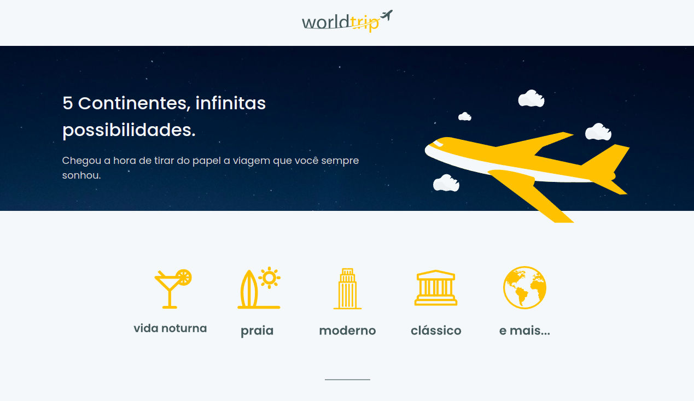
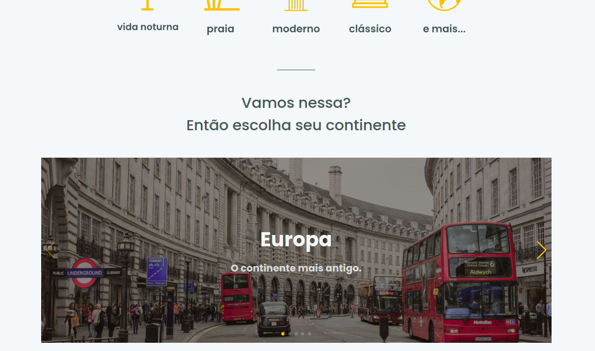

<h1 align="center">World Trip</h1>

<p align="center">
  
  
  <a href="https://github.com/jtiagosantos/world-trip/commits/master">
    
  </a>
  
   <a href="https://github.com/jtiagosantos/world-trip/stargazers">
    
  </a>
</p>

<h4 align="center"> 
	🚧  
World Trip 🌎 Completed 🚀 🚧
</h4>

<p align="center">
  <a href="#-features">Features</a> •
  <a href="#-run-project">Run Project</a> • 
  <a href="#-technologies">Technologies</a> • 
  <a href="#-layout">Layout</a> •
  <a href="#-deploy">Deploy</a> •
  <a href="#-author">Author</a> • 
  <a href="#-license">License</a>
</p>

<br>

<h1 align="center">
    
</h1>

<h1 align="center">
    
</h1>

<hr />

## ⚙️ Features

- [x] See all continents
- [x] See a continent details 
- [x] Responsiveness

<hr>

## 🚀 Run Project

1️⃣ Clone project and access its folder:

```bash
$ git clone https://github.com/jtiagosantos/world-trip.git
$ cd world-trip
```

2️⃣ Install dependencies:

```bash
$ yarn ou npm i
```

3️⃣ Add environment variables:

```bash
#Heroku
HEROKU_BASE_URL_SERVER=xxxxxxxxxxxxxxxxxxx
```

4️⃣ Start project:

```bash
$ yarn dev ou npm run dev
```
<hr>

## 🛠 Technologies

The following tools were used in the construction of project:

- **[Next.js](https://nextjs.org/)**
- **[Typescript](https://www.typescriptlang.org/)**
- **[Chakra UI](https://chakra-ui.com/)**
- **[Axios](https://axios-http.com/docs/api_intro)**
- **[Json-Server](https://www.npmjs.com/package/json-server)**
- **[ESLint](https://eslint.org/)**
- **[Prettier](https://prettier.io/)**

<hr>

## 🔖 Layout

You can view the project layout through the link below:

- **[Layout Web](https://www.figma.com/file/0Q2duHAmUFSFOoQT6NDJ11/Desafio-1-M%C3%B3dulo-4-ReactJS-(Copy)?node-id=0%3A1)**

<hr>

## :cloud: Deploy

- **[World Trip](https://world-trip-dq453nmge-jtiagosantos.vercel.app/)**

<hr>

## 👨‍💻 Author


<strong><a href="https://github.com/jtiagosantos">Tiago Santos </a>🚀</strong>

[](https://www.linkedin.com/in/josetiagosantosdelima/)
[](mailto:tiago.santos@icomp.ufam.edu.br)

<hr>

## 📝 License

This project is under license [MIT](./LICENSE).
